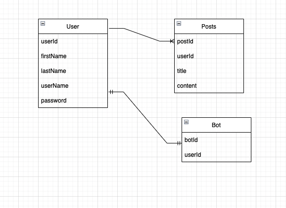
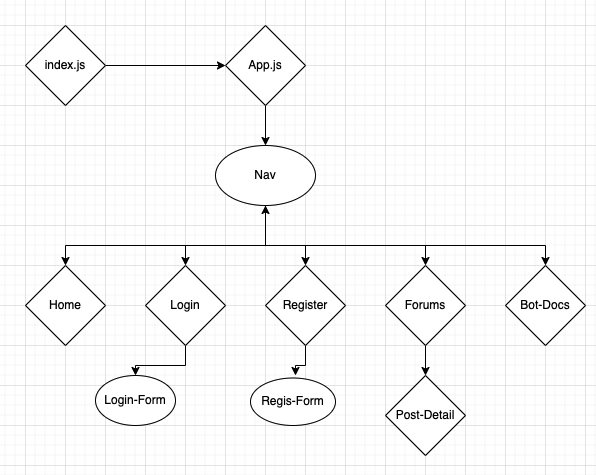

 DNDbot

## Technologies Used:
- PERN Stack

- Emotion/MUI

## Description:

My site will host a custom made Discord bot that will allow users to access the [DND 5e API](http://www.dnd5eapi.co/) within their particular servers. The user will register/login. Once done, they will then have access to the DNDbot. If the user finds any bugs with the bot, they can create a forum post indicating their bug.

## Future Plans:

- [Trello](https://trello.com/b/1BTQZbZN/dndbot)

- [ERD](https://app.diagrams.net/#G1GHQgjcnqkhGrKZwh8UxJTjkmSnCAaihW)

- [Comp Map](https://app.diagrams.net/#G1aA5ywTOAH8ZFj7ReOu8qQlgRT7yCoMMn)

